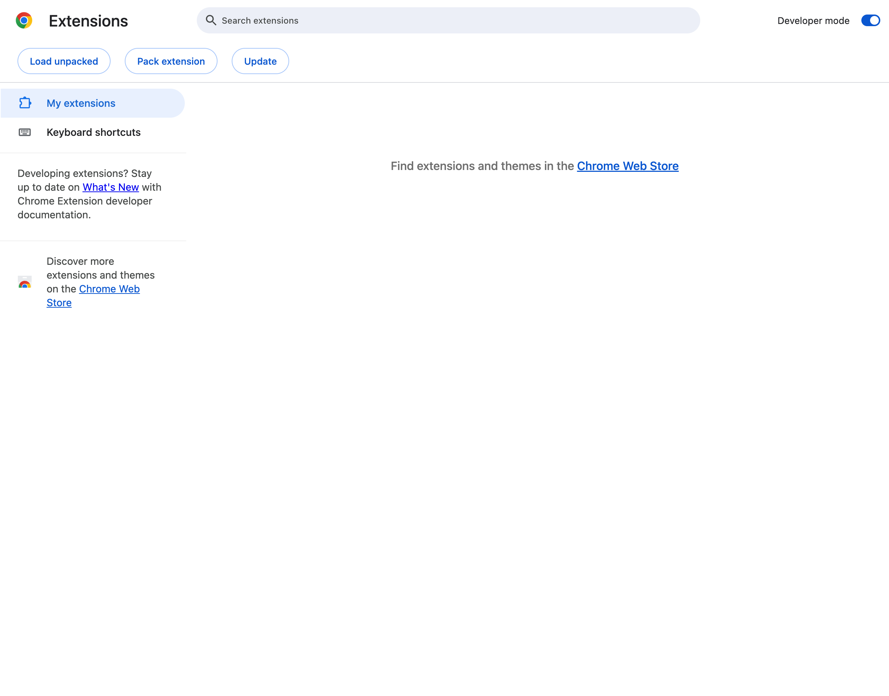

# Writer AI ✍️

A Chrome extension that helps you craft intelligent, personalized content using AI on **any website**. Works with Twitter/X, Reddit, Gmail, LinkedIn, and all text input fields.


## 🚀 Quick Install

### 1. Download the Extension

```bash
git clone https://github.com/calio/writer.git
cd writer
```

Or [download as ZIP](https://github.com/calio/writer/archive/refs/heads/main.zip) and extract.

### 2. Load in Chrome

**Step 1:** Open Chrome and go to `chrome://extensions/`


**Step 2:** Enable **Developer mode** (toggle in top right)



**Step 3:** Click **Load unpacked** and select the `writer` folder

The Writer AI icon should now appear in your extensions toolbar.

### 3. Configure API Key

1. Click the Writer AI icon in your Chrome toolbar
2. Select your **AI Provider** (Anthropic or OpenAI)
3. Enter your **API Key**:
   - Anthropic: [console.anthropic.com](https://console.anthropic.com/)
   - OpenAI: [platform.openai.com](https://platform.openai.com/)
4. Click **Save Settings**

## 💡 How to Use

### Universal Mode (Works Everywhere!)

Writer AI now works on **any website** with text input fields:

1. Navigate to any website (Gmail, LinkedIn, Discord, Slack, etc.)
2. Focus on or click near any text input field or textarea
3. Look for the **purple AI button** that appears near the input
4. Click it to open the AI assistant panel
5. The extension automatically extracts context from the page
6. Review AI-generated options and click **Use this text**

### Platform-Specific Features

**Twitter/X:**
- Integrated reply button in the tweet toolbar
- Analyzes tweet content and images
- Matches your Twitter voice

**Reddit:**
- Button appears in comment forms
- Understands post context
- Adapts to subreddit tone

## ✨ Features

- **Universal Input Detection**: Automatically works on any website with text inputs
- **Smart Context Extraction**: Analyzes page content to understand what you're replying to
- **AI-Powered Writing**: Generate multiple options using GPT or Claude
- **Multiple Tones**: Professional, Casual, Witty, Thoughtful, Concise, or Detailed
- **Vision Support**: Analyzes images in tweets for context-aware replies (Twitter)
- **Conversational Refinement**: Iteratively improve generated text with feedback
- **Platform Support**: Twitter/X, Reddit, Gmail, LinkedIn, and **any website**

## 🔐 Privacy

- API keys stored locally in Chrome's secure storage
- Post history cached locally for context
- No data sent except to your chosen AI provider
- All API calls made directly from your browser

## 🐛 Troubleshooting

**Extension not appearing?**
- Refresh the page after installing
- Verify extension is enabled at `chrome://extensions/`

**API errors?**
- Check your API key is correct
- Ensure you have available API credits

**Button not showing?**
- Click on a tweet/post first to open the reply view
- Refresh the page
- Try both new and old Reddit interfaces

## 📄 License

MIT License

---

Made with ❤️ and AI
